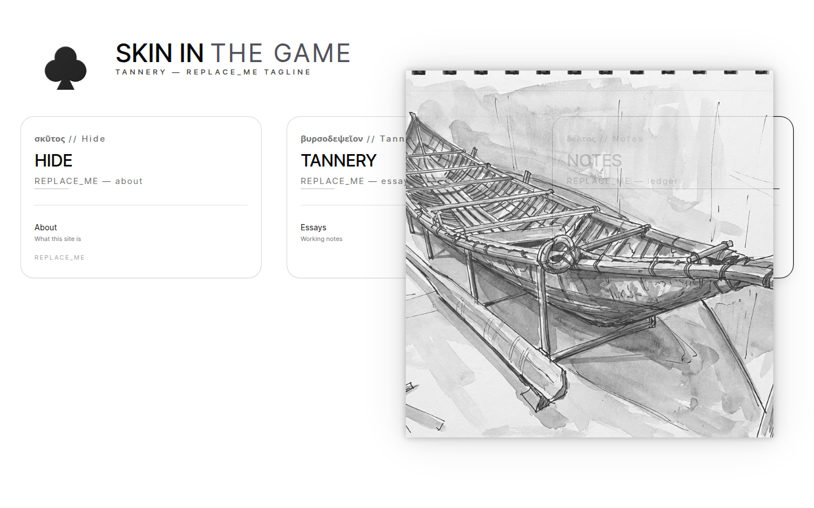
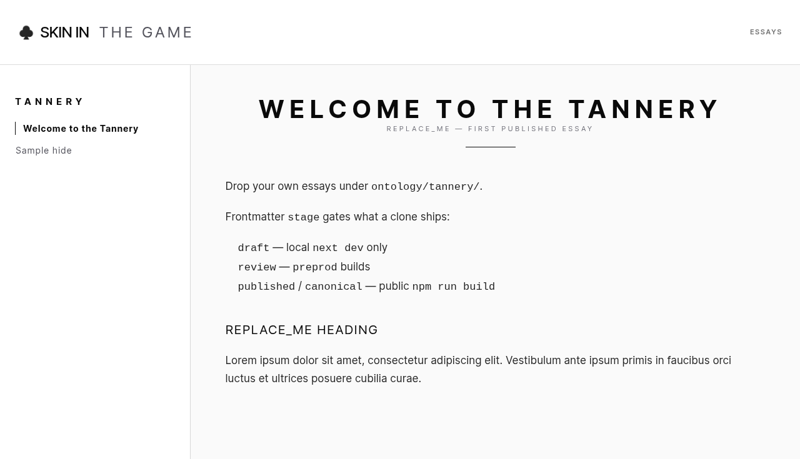

# Skin in the Game (Tannery)

Content-shorn Next.js site scaffold. Clone it, open it in an IDE, and drop in your own writing.

Display name: **Skin in the Game (Tannery)**. Repo: `tannery`.

The app shell (layouts, bento home, reading routes, theming, draft→published frontmatter) is inspired by [Transition Insight](https://github.com/patelashit550-cpu/transition-insight). This template does not include that project's personal corpus.

## Preview

Home:


Welcome to the Tannery:


## Install and run

```bash
npm install
npm run dev
```

Open [http://localhost:3000](http://localhost:3000).

For an AI-IDE walkthrough, see [How to Build a Web Application Using Tannery and an AI IDE](docs/how-to-build-with-ai-ide.md).

Production static export:

```bash
npm run build
```

That writes `out/` (Next.js `output: "export"`). Preview with any static file server.

Optional content tiers:

```bash
npm run dev:local     # drafts visible
npm run build:preprod # review + published
npm run build:global  # published / canonical only
```

## Where your content goes

Put Markdown (or MDX) under **`ontology/`**. That is the corpus root. There is no `src/content` tree in this scaffold.

```
ontology/
  hide/about.md          →  /hide/about/
  tannery/welcome.md     →  /tannery/welcome/  and hub  /tannery/essays/
  tannery/sample.md      →  /tannery/essays/sample/
  notes/ledger.md        →  /notes/ledger/
  notes/draft-note.md    →  local only (stage: draft)
```

Each file uses YAML frontmatter. Required-ish fields:

```yaml
---
title: REPLACE_ME
subtitle: REPLACE_ME
slug: my-slug
stage: draft          # draft | review | published | canonical
order: 1
publishedAt: 2026-01-01
tags:
  - REPLACE_ME
showInNav: true
---
```

- **`stage: draft`** — `next dev` only. Production `npm run build` hides it.
- **`stage: review`** — included in `build:preprod`.
- **`stage: published`** or **`canonical`** — public export.

Replace the placeholder posts. Do not leave `REPLACE_ME` in shipped writing.

Home columns and reading-header siblings live in `src/config/site.ts` (`BentoRegistry`). Point `href` at `/topic/slug` routes that match files under `ontology/`.

Hub example: `src/lib/content-routes.ts` maps `/tannery/essays` to the `ontology/tannery/` folder.

## Site identity

Edit `src/config/site.ts` and the header copy in:

- `src/components/layout/Header.tsx`
- `src/components/layout/NarrativeHeader.tsx`

Copy `.env.local.example` to `.env.local` for `NEXT_PUBLIC_SITE_URL` and optional IPFS keys. Never commit `.env.local`.

## Optional ship / IPFS

`npm run ship` builds a global export. Add `--ipfs` only if you have filled `PINATA_JWT` in `.env.local` (see `.env.sovereign.example`). These scripts are examples, not required to use the site.

```bash
npm run ship
npm run ship -- --ipfs
```

## Checks

```bash
npm test
npm run lint
npm run build
```

## License / credit

This utility is provided without reservations - copyleft Transition Insight 
